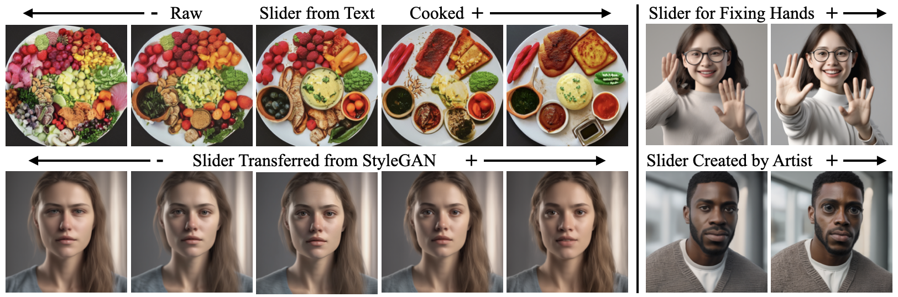

# Concept Sliders
###  [Project Website](https://sliders.baulab.info) | [Arxiv Preprint](https://arxiv.org/pdf/2311.12092.pdf) | [Trained Sliders](https://sliders.baulab.info/weights/xl_sliders/) | [Colab Demo](https://colab.research.google.com/github/rohitgandikota/sliders/blob/main/demo_concept_sliders.ipynb) | [Huggingface Demo](https://huggingface.co/spaces/baulab/ConceptSliders) <br>
Official code implementation of "Concept Sliders: LoRA Adaptors for Precise Control in Diffusion Models", European Conference on Computer Vision (ECCV 2024).

## 🎉 NEW: SliderSpace 🎉
Experience the next evolution in concept control! **SliderSpace** automatically extracts hundreds of sliders from diffusion models' creative knowledge - no training required! Unlock unprecedented creativity with zero effort. [Check out SliderSpace repo](https://github.com/baulab/sliderspace) 🚀🎨✨
<div align='center'>

</div>

## Colab Demo
Try out our colab demo here [](https://colab.research.google.com/github/rohitgandikota/sliders/blob/main/demo_concept_sliders.ipynb)

## FLUX Support 🚀🚀🚀
You can train sliders for FLUX-1 models. Right now it is experimental! Please be patient if it doesn't work as good as SDXL. FLUX is not designed the same way as SDXL. <br>

To play with flux sliders you need to update your packages. 
```
pip install -r flux-sliders/flux-requirements.txt
```

Now just open the notebook present in the folder `flux-sliders` and have fun! 

## UPDATE
You can now use GPT-4 (or any other openAI model) to create prompts for your text sliders. All you need to do is describe what slider you want to create (e.g: "i want to make people look happy"). <br>
Please refer to the [GPT-notebook](https://github.com/rohitgandikota/sliders/blob/main/GPT_prompt_helper.ipynb)

## Setup
To set up your python environment:
```
conda create -n sliders python=3.9
conda activate sliders

git  clone https://github.com/rohitgandikota/sliders.git
cd sliders
pip install -r requirements.txt
```
If you are running on Windows - please refer to these Windows setup guidelines [here](https://github.com/rohitgandikota/sliders/issues/27#issuecomment-1833572579)
## Textual Concept Sliders
### Training SD-1.x and SD-2.x LoRa
To train an age slider - go to `train-scripts/textsliders/data/prompts.yaml` and edit the `target=person` and `positive=old person` and `unconditional=young person` (opposite of positive) and `neutral=person` and `action=enhance` with `guidance=4`. <br>
If you do not want your edit to be targetted to person replace it with any target you want (eg. dog) or if you need it global replace `person` with `""`  <br>
Finally, run the command:
```
python trainscripts/textsliders/train_lora.py --attributes 'male, female' --name 'ageslider' --rank 4 --alpha 1 --config_file 'trainscripts/textsliders/data/config.yaml'
```

`--attributes` argument is used to disentangle concepts from the slider. For instance age slider makes all old people male (so instead add the `"female, male"` attributes to allow disentanglement)


#### Evaluate 
To evaluate your trained models use the notebook `SD1-sliders-inference.ipynb`


### Training SD-XL
To train sliders for SD-XL, use the script `train_lora_xl.py`. The setup is same as SDv1.4

```
python trainscripts/textsliders/train_lora_xl.py --attributes 'male, female' --name 'agesliderXL' --rank 4 --alpha 1 --config_file 'trainscripts/textsliders/data/config-xl.yaml'
```

#### Evaluate 
To evaluate your trained models use the notebook `XL-sliders-inference.ipynb`


## Visual Concept Sliders
### Training SD-1.x and SD-2.x LoRa
To train image based sliders, you need to create a ~4-6 pairs of image dataset (before/after edit for desired concept). Save the before images and after images separately. You can also create a dataset with varied intensity effect and save them differently. 

To train an image slider for eye size - go to `train-scripts/imagesliders/data/config.yaml` and edit the `target=eye` and `itive='eye'` and `unconditional=''` and `neutral=eye` and `action=enhance` with `guidance=4`. <br>
If you want the diffusion model to figure out the edit concept - leave `target, positive, unconditional, neutral` as `''`<br>
Finally, run the command:
```
python trainscripts/imagesliders/train_lora-scale.py --name 'eyeslider' --rank 4 --alpha 1 --config_file 'trainscripts/imagesliders/data/config.yaml' --folder_main 'datasets/eyesize/' --folders 'bigsize, smallsize' --scales '1, -1' 
```
For this to work - you need to store your before images in `smallsize` and after images in `bigsize`. The corresponding paired files in both the folders should have same names. Both these subfolders should be under `datasets/eyesize`. Feel free to make your own datasets in your own named conventions.
### Training SD-XL
To train image sliders for SD-XL, use the script `train-lora-scale-xl.py`. The setup is same as SDv1.4

```
python trainscripts/imagesliders/train_lora-scale-xl.py --name 'eyesliderXL' --rank 4 --alpha 1 --config_file 'trainscripts/imagesliders/data/config-xl.yaml' --folder_main '/share/u/rohit/imageXLdataset/eyesize_data/'
```

## Editing Real Images
Concept sliders can be used to edit real images. We use null inversion to edit the images - instead of prompt, we use sliders! <br>
Checkout - `demo_image_editing.ipynb` for mode details.

## Running Gradio Demo Locally
You can also run the HF hosted gradio slider tool (huge shoutout to gradio and HF team) locally using the following scripts
```
git lfs install
git clone https://huggingface.co/spaces/baulab/ConceptSliders
cd ConceptSliders
pip install requirements.txt
python app.py
```
For more inference time gradio demos please refer to Cameduru's repo [here](https://github.com/camenduru/sliders-colab)

## Running with ControlNet Integration
Our user community is amazing! Here is the resource that integrates ControlNet: https://github.com/rohitgandikota/sliders/issues/76#issuecomment-2099766893
## Citing our work
The preprint can be cited as follows
```
@inproceedings{gandikota2023erasing,
  title={Erasing Concepts from Diffusion Models},
  author={Rohit Gandikota and Joanna Materzy\'nska and Tingrui Zhou and Antonio Torralba and David Bau},
  booktitle={Proceedings of the 2024 IEEE European Conference on Computer Vision},
  note={arXiv preprint arXiv:2311.12092},
  year={2024}
}
```
